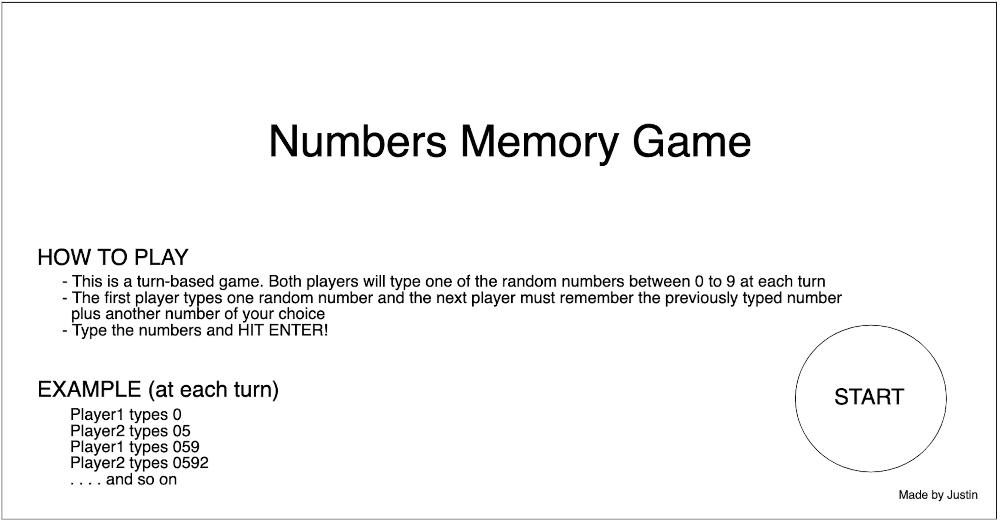
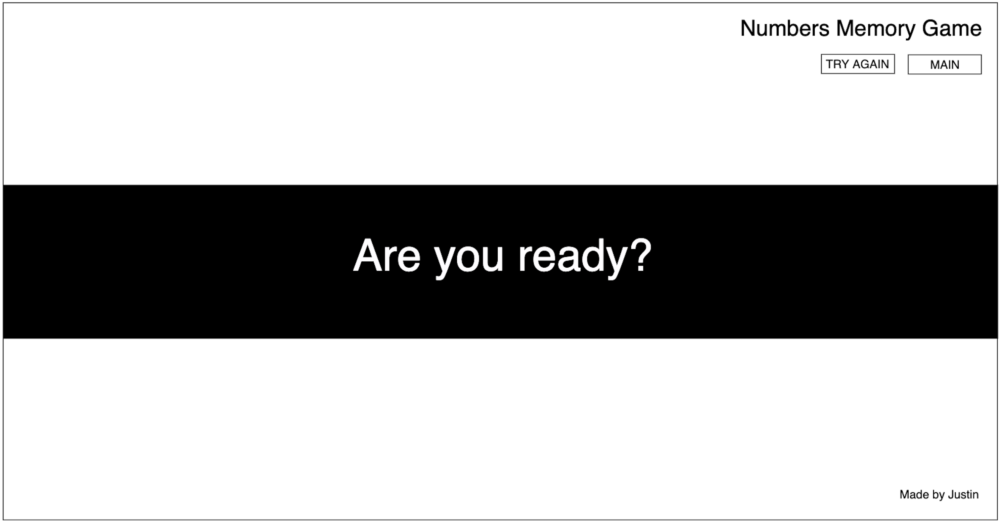
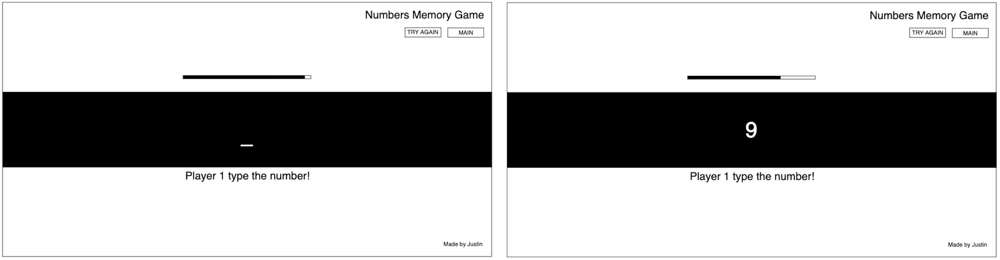
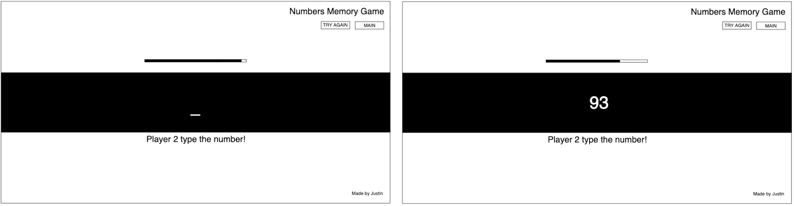
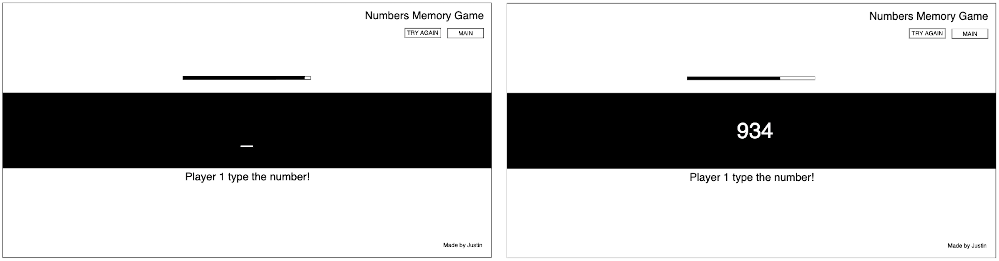

# Numbers Memory Game
## Overview
-  Numbers Memory Game helps to increase your memory and good for the prevention of dementia, so try with your friends to see how many numbers you can memorize!

## Game Rules
- Numbers Memory Game is a turn-based game with two players.
- The first player will type one random number between 0 to 9 and the next player will type the number that the first player typed plus another random number between 0 to 9 of your choices and so on. 
- Both player1 and player2 need to remember each number that has been typed. 
- Whoever typed the wrong numbers lost...

## How does the Numbers Memory Game look like?

Are you ready? If you read the game rules, let's start the game!

## Get Ready!

The game will automatically start in five seconds

## First turn, PLAYER1!

The player1 will type a random number between 0 to 9

## Player2, it's your turn

The player2 must type the number that player1 typed and plus another random number of your choice

## Back to the Player1

Turn over, the player1 must type first and second number that typed and plus another random number of your choice

## User Stories
- The game starts when the user clicks the start button
- Once the games start, the user will be able to type the numbers. There will be a remaining time bar (probably 5~10 seconds/TBU)
- When the player types one number and hits enter and the the message will display as "it's next player's turn" and the game continues....
- When one of the players types the incorrect numbers, the game will just stop unless the user clicks the "TRY AGAIN" button
- Button
    - TRY AGAIN: When the game has the winner, the button will re-start the game
    - MAIN: Going back to the main page

## MVP Checklist
1. Get the HTML and basic CSS/ 'Remaining time' functionalities done by Monday or Tuesday 
2. User input functinalities and find bugs by Friday(or Saturday)
3. Mostly working on the styling and designing the project on Saturday and Sunday

## Stretch goals
I want to make the game look trendy! Setting the background as video and multiple sounds effect on the user attempts. Trying to make it look like this is made in 2021.

